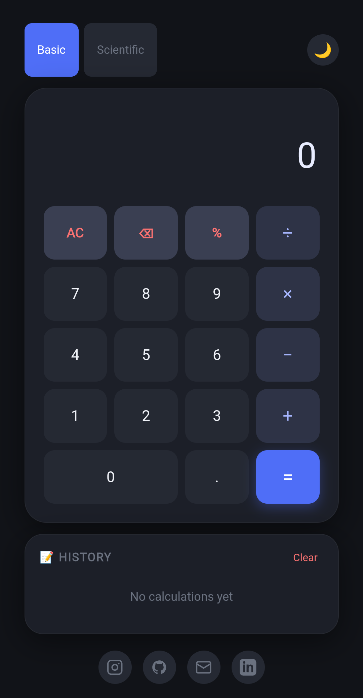
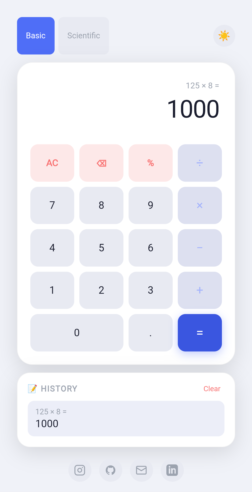

# 🧮 Calculator

## 📌 Overview
A simple and responsive calculator built using HTML, CSS, and JavaScript. It performs basic arithmetic operations with a clean and user-friendly interface.

## ✨ Features
- Addition, Subtraction, Multiplication, and Division
- Responsive design
- Fast calculations
- Clean user interface
- Browser-based application

## 🛠️ Technologies Used
- HTML5
- CSS3
- JavaScript

## 🚀 Live Demo
https://muthupriyan-dev.github.io/calculator/calculator.html

## 📷 Screenshots

### Home Screen

### Calculation Result

## 💻 How to Use
1. Open the live demo.
2. Enter numbers using the calculator buttons.
3. Select an operation.
4. Press `=` to get the result.

## 👨‍💻 Author
**Muthupriyan**

GitHub: https://github.com/muthupriyan-dev

